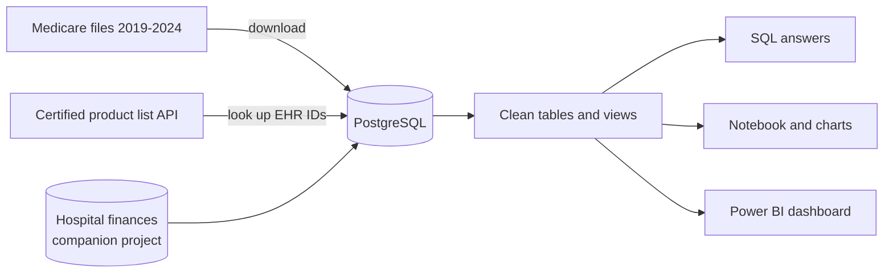

# US Hospital EHR Interoperability Analysis

Every year, Medicare checks whether each US hospital uses certified electronic health record (EHR) software to
share patient records with other providers, send prescriptions electronically, let patients see their records
online and report to public health. Hospitals that fail the check lose part of their Medicare payment.

I looked at six years of these results (2019 to 2024, about 4,500 hospitals a year) to find out which hospitals
fail and why. I also looked up each hospital's EHR software in the government's list of certified products and
added each hospital's yearly financial report.


> ### In short
> - **About 1 in 8 US hospitals failed in 2024** (574 of 4,489). In 2019 it was 1 in 5, so things are improving.
> - **Most of the hospitals that failed had no certified EHR at all.** That was true for 8 in 10 of them. The
>   main problem is hospitals without the right software, not hospitals using it badly.
> - **Small rural hospitals fail about twice as often** as other hospitals (19% against 10%), and this has been
>   true every year since 2019.
> - **The software company matters.** About 1 in 100 hospitals using Epic or Oracle Health failed. For TruBridge,
>   a system common in small rural hospitals, it was 14 in 100.
> - **Money matters.** Hospitals that lost money two years in a row failed about twice as often.
> - **The data has problems of its own.** 585 hospitals typed "Not Available" where their EHR software ID should be,
>   and two Medicare files give different answers for 430 hospitals.
>
> I built a database, checked the quality of the data, answered the questions with SQL, and made an interactive
> dashboard. Anyone can filter it by hospital type, owner, rural or urban, state and EHR company, or look up a
> single hospital.
>
> **Next step:** my [EHR Interoperability Risk Model](https://github.com/Isaac-Agyapong/EHR_Interoperability_Risk_Model)
> uses this data to predict which hospitals will fail next year.

The rest of this page has the details.

---

## Dashboard

A Power BI report with seven pages. The filters on the right change every number and chart. Hover over a state to
see its details. The first page is shown at the top.

**EHR Companies:** which companies make hospitals' EHR software, and how often their hospitals fail.


**Money and History:** hospitals that lose money fail more often, and 169 hospitals failed every year since 2019.


**States:** a map showing the share of hospitals failing in each state, and the 10 states with the highest share.


**Find a Hospital:** type a hospital's name to see whether it passed, its EHR company and its record each year.


**Data Quality:** the problems I found in the data itself.


**Data Notes:** what the words mean, where the data comes from, and its limits.


## What I found

"Failed" means the hospital did not meet Medicare's standard that year. I looked at the two kinds of hospital the
check applies to: general hospitals and small rural hospitals (25 beds or fewer, called "critical access"
hospitals). The query behind each number is in [SQL/query_results.md](SQL/query_results.md).

| Finding | Query |
|---|---|
| 574 of 4,489 hospitals (13%) failed in 2024 | 5 |
| Small rural hospitals failed 19% of the time, general hospitals 10% | 2 |
| Small rural hospitals went from 30% failing (2019) to 24% (2024); general hospitals from 16% to 10% | 1 |
| 448 of the 574 that failed (78%) reported no certified EHR | 5 |
| Share failing by EHR company: Epic 1.1%, Oracle Health 1.3%, MEDITECH 4.0%, TruBridge 13.9% | 3 |
| Among small rural hospitals only: TruBridge 15.4%, Epic 3.0% | 4 |
| Three companies (Epic, Oracle Health, MEDITECH) make the EHR software of 85% of hospitals | 12 |
| Hospitals that lost money two years in a row: 25% failed against 15% (small rural), 12% against 6.5% (general) | 6 |
| The least profitable fifth of hospitals failed 19.7% of the time; the other fifths 6.7% to 10.1% | 7 |
| Hospitals with under 25 beds failed 23% of the time; those with 250 or more, 4% | 8 |
| By owner: nonprofit 9%, for-profit 17%, government 19%, owned by doctors 22% | 2 |
| Highest by state: Puerto Rico 45%, Idaho 29%, Nevada and Texas 26% | 9 |
| Of hospitals in all six years of data, 2,770 never failed and 169 failed every year | 10 |
| Hospitals with no financial report on file failed 60% of the time | 2 |

## What could help

1. **Start with hospitals that have no certified EHR.** They make up 8 in 10 of the hospitals that fail. Helping
   them get certified software would close most of the gap.
2. **Give small rural hospitals shared IT support**, for example through health systems, state networks or rural
   health IT grants. They fail twice as often and often run smaller EHR systems.
3. **Keep an eye on hospitals that are losing money.** Two years of losses doubles the chance of failing. My
   [Hospital Financial Distress Model](https://github.com/Isaac-Agyapong/Hospital_Financial_Distress_Model) predicts
   which hospitals will end up in that group.
4. **Check the EHR ID when hospitals submit it.** A simple check at submission would stop entries like
   "Not Available" or IDs that don't exist from reaching the public data.
5. **Watch how few companies there are.** With three companies serving 85% of hospitals, their choices shape
   record sharing for almost everyone.

## Data

All public, all real:

| Source | What I used |
|---|---|
| [Medicare (CMS) Hospital General Information](https://data.cms.gov/provider-data/dataset/xubh-q36u) ([yearly files](https://data.cms.gov/provider-data/archived-data/hospitals)) | 2019-2024: each hospital's type, owner and whether it passed |
| [Medicare Promoting Interoperability file](https://data.cms.gov/provider-data/topics/hospitals) | Newest release, with the ID of each hospital's certified EHR software |
| [Government list of certified health IT products (ONC CHPL)](https://chpl.healthit.gov/) | The company and products behind each of 962 EHR IDs |
| My [US Hospital Financial Performance Analysis](https://github.com/Isaac-Agyapong/US_Hospital_Financial_Performance_Analysis) | Profit, size, rural or urban, and losses from each hospital's yearly financial report |

## Problems I found in the data, and what I did

| Problem | What I did |
|---|---|
| A blank result means two things: "failed" for general and small rural hospitals, but "not checked at all" for psychiatric, children's, VA and military hospitals | Kept only the two hospital types Medicare checks |
| 585 hospitals typed "Not Available" instead of their EHR ID | Counted them as "no EHR reported" (none of them passed) |
| 9 EHR IDs were in the wrong format, and 24 IDs were not in the government's product list | Kept them, and showed them on the Data Quality page |
| One EHR ID can cover several products from different companies | Counted the company with the most core EHR products as the hospital's main EHR company |
| Two Medicare files disagree for 430 hospitals, because they cover different time periods | Used each file only for the period it covers |
| 432 hospitals appear in only some years (they opened, closed or merged) | Used all hospitals for yearly totals, and only hospitals in all six years when counting "never" and "every year" |
| Column names changed over the years | Matched every old name to one current name |
| 4% of hospitals have no financial report on file | Kept them, because they fail much more often |

I also checked every number on the dashboard against the SQL results.

## Technical details

For readers who want the specifics:

- **SQL (PostgreSQL 18):** raw, core and analytics layers; a star schema; CTEs; window functions (`LAG`, `NTILE`,
  `RANK`); `FILTER`; a `LATERAL` join; a market concentration index (HHI 3,030); a materialized view. Data-quality
  checks in [SQL/03_data_quality.sql](SQL/03_data_quality.sql).
- **Python:** downloads from the Medicare data site with checksums; calls to the ONC product list API (key kept in
  a `.env` file, not in Git); bulk loading into PostgreSQL; an analysis notebook
  ([Python/04_analysis.ipynb](Python/04_analysis.ipynb)).
- **Power BI:** the whole report is generated from Python as a Power BI project file, so it can be rebuilt and
  version-controlled. DAX measures follow every filter, chart titles update with the filters, a tile map of the
  states, a hospital lookup page and a hover tooltip page.



### Charts from the analysis notebook

| | |
|---|---|
|  |  |
|  |  |
|  |  |
|  |  |

### Files

```
Data/raw/      list of source files with links and checksums (the large downloads are not in Git)
Python/        01 download, 02 load PostgreSQL, 03 run SQL, 04 notebook, 05-06 build the Power BI report
SQL/           database, tables, cleaning, data-quality checks, views, questions, query_results.md
dashboard/     EHR_Interoperability.pbip (open in Power BI Desktop) and its data
Image/         charts and dashboard pictures
run_all.py     rebuilds everything in order
```

### Run it yourself

1. Install Python 3.13, PostgreSQL 18 and Power BI Desktop, then run `pip install -r requirements.txt`.
2. Build my [financial project](https://github.com/Isaac-Agyapong/US_Hospital_Financial_Performance_Analysis) first,
   because this project reads its database.
3. Get a free API key from the [CHPL website](https://chpl.healthit.gov/) and save it as `CHPL_API_KEY=...` in a
   `.env` file in the project folder.
4. Run `python run_all.py`.

To just look at the dashboard, open `dashboard/EHR_Interoperability.pbip` in Power BI Desktop. It reads the CSV
files in `dashboard/data/`, so you don't need a database. If you saved the project in a different folder, go to
Transform data > Edit parameters, set `DataFolder` to your `dashboard\data\` folder, then click Refresh.

## Limits

- The data shows whether a hospital passed Medicare's check, not how well it really shares records.
- Two Medicare files cover different time periods, so 430 hospitals have different results in each.
- The links between software, money, size and failing don't prove cause. Smaller hospitals with less money often
  buy smaller systems and have fewer IT staff.
- "Main EHR company" is my own rule for hospitals whose software comes from several companies.
- Puerto Rico and four small territories are included, but only Puerto Rico is on the dashboard map.

---

Built by **Isaac Agyapong** · [GitHub](https://github.com/Isaac-Agyapong)
