# US Hospital EHR Interoperability Analysis

**Can US hospitals share health records electronically, and which ones are falling behind?** Every year Medicare
checks whether each hospital uses certified electronic health record (EHR) software to share records with other
providers, send prescriptions electronically, give patients online access and report to public health. I combined
six years of these results (2019 to 2024, about 4,500 hospitals a year) with the federal list of certified EHR
software and the hospitals' own financial reports.

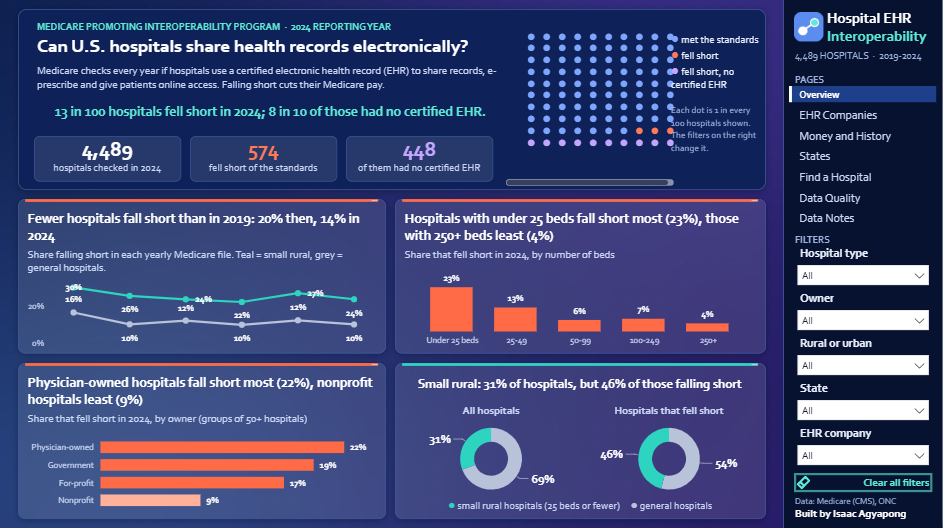

> ### In short
> - **About 1 in 8 US hospitals fell short in 2024.** 574 of 4,489 hospitals did not meet Medicare's standards for
>   sharing records electronically, which cuts their Medicare payments. In 2019 it was 1 in 5.
> - **Most of them had no certified EHR at all.** 8 in 10 hospitals that fell short did not report any certified
>   EHR software. The problem is mostly hospitals without the right system, not hospitals using it badly.
> - **Small rural hospitals fall short about twice as often** (19% against 10% for other hospitals), and the gap has
>   been there every year since 2019.
> - **The software company matters.** Hospitals on Epic or Oracle Health almost never fall short (about 1 in 100).
>   Hospitals on TruBridge, a system common in small rural hospitals, fall short 14 times in 100, even compared with
>   the same kind of hospital.
> - **Money matters.** Hospitals that lost money two years in a row fall short about twice as often as those that
>   did not.
> - **The data itself has gaps.** 585 hospitals typed "Not Available" where the ID of their EHR software should be,
>   and the two Medicare files give different answers for 430 hospitals.
>
> I built a database, checked the data the way EHR data-quality research does, answered the questions with SQL, and
> made an interactive dashboard where anyone can filter by hospital type, owner, rural or urban, state and EHR
> company, or look up a single hospital.

The sections below go into technical detail.

---

## Key findings

"Fell short" means the hospital did not meet the Medicare Promoting Interoperability program for the year. The study
group is the two hospital types the program applies to: general acute care hospitals and critical access hospitals
(small rural hospitals with 25 beds or fewer). Every number comes from [SQL/query_results.md](SQL/query_results.md).

| Finding | Evidence |
|---|---|
| 574 of 4,489 hospitals (13%) fell short in the latest reporting year (2024) | Business Q5 |
| Critical access hospitals fall short 19% of the time, general hospitals 10% | Business Q2 |
| The gap holds every year: critical access 30% (2019) to 24% (2024), general 16% to 10% | Business Q1 |
| 448 of the 574 (78%) reported no certified EHR at all | Business Q5 |
| Share falling short by main EHR company: Epic 1.1%, Oracle Health 1.3%, MEDITECH 4.0%, TruBridge 13.9% | Business Q3 |
| Among critical access hospitals only: TruBridge 15.4% against Epic 3.0% | Business Q4 |
| Three companies (Epic, Oracle Health, MEDITECH) run 85% of hospital EHRs; market concentration index (HHI) 3,030, "highly concentrated" | Business Q12 |
| Lost money two years in a row: 25% fall short against 15% (critical access); 12% against 6.5% (general) | Business Q6 |
| The least profitable fifth of hospitals fall short 19.7% of the time; the other fifths 6.7% to 10.1% | Business Q7 |
| Hospitals with under 25 beds fall short 23% of the time, those with 250+ beds 4% | Business Q8 |
| Nonprofit 9%, for-profit 17%, government 19%, physician-owned 22% | Business Q2 |
| Highest shares: Puerto Rico 45%, Idaho 29%, Nevada and Texas 26% | Business Q9 |
| Of hospitals in all six yearly files, 2,770 never fell short and 169 fell short every year | Business Q10 |
| Hospitals with no matching financial report fall short 60% of the time (missing data is itself a warning sign) | Business Q2 |

## Recommendations

1. **Start with hospitals that have no certified EHR.** They are 8 in 10 of the hospitals that fall short. Outreach
   and help to adopt certified software would close most of the gap.
2. **Give small rural hospitals shared IT support.** They fall short twice as often and many run on smaller EHR
   systems. Shared services through health systems, rural health IT grants or state networks fit their size.
3. **Watch hospitals under financial stress.** Losing money two years in a row doubles the chance of falling short;
   the [Hospital Financial Distress Model](https://github.com/Isaac-Agyapong/Hospital_Financial_Distress_Model)
   already forecasts which hospitals will be in that group.
4. **Check the EHR ID when hospitals submit it.** A simple format check and a lookup in the federal product list at
   submission would stop "Not Available", lowercase or unknown IDs from entering the public data.
5. **Mind the market concentration.** With three companies running 85% of hospitals, rules and prices set by a few
   vendors shape interoperability for almost everyone.

## Data sources

All public, all real:

| Source | What I used |
|---|---|
| [CMS Hospital General Information](https://data.cms.gov/provider-data/dataset/xubh-q36u) ([yearly archives](https://data.cms.gov/provider-data/archived-data/hospitals)) | Six yearly files, 2019-2024: every hospital's type, owner and whether it met the interoperability standards |
| [CMS Promoting Interoperability (hospital file)](https://data.cms.gov/provider-data/topics/hospitals) | Latest release (2024 reporting year), with the ID of each hospital's certified EHR software |
| [ONC Certified Health IT Product List (CHPL)](https://chpl.healthit.gov/) | Every EHR ID looked up through the CHPL API to find the company and products behind it (962 IDs) |
| [US Hospital Financial Performance Analysis](https://github.com/Isaac-Agyapong/US_Hospital_Financial_Performance_Analysis) | My companion project: profit, size, rural or urban and losses from the hospitals' cost reports |

`Python/01_download_data.py` downloads the CMS archives and records each file's URL, size and checksum in
[Data/raw/manifest.json](Data/raw/manifest.json). The CHPL look-ups are cached in `Data/raw/chpl_cehrt.json`; they
need a free CHPL API key, kept in a `.env` file that is not in Git.

## How it works

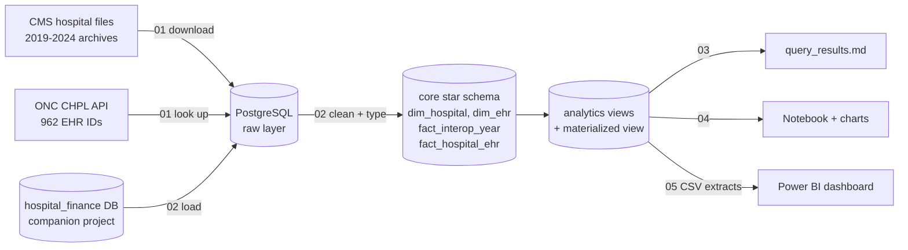

## Data problems I found and fixed

I checked the data on the dimensions used in EHR data-quality research: completeness, conformance, plausibility,
consistency between files and over time, and linkage ([SQL/03_data_quality.sql](SQL/03_data_quality.sql)).

| Problem | What I did |
|---|---|
| **A blank status means two different things.** For general and critical access hospitals it means "did not meet"; psychiatric, children's, VA and military hospitals are never rated and are always blank. | Kept only the two hospital types the program applies to (a check confirms the others are never marked as meeting it). |
| **"Not Available" typed into the EHR ID field** by 585 hospitals. | Treated as "no EHR ID reported". None of them met the standards. |
| **Malformed EHR IDs** (lowercase or wrong length): 9 hospitals. | Kept; flagged on the dashboard's data quality page. |
| **EHR IDs the federal product list does not know**: 24 IDs, used by 26 hospitals. | Kept as "not identified". |
| **One EHR ID covers a bundle of products**, often from several companies (an EHR plus add-ons such as quality-reporting tools). | Defined the main EHR company as the core EHR vendor with the most products in the bundle; add-on vendors are not counted. |
| **The two Medicare files disagree** for 430 hospitals, because they cover different reporting periods. | Used the yearly general files for the 2019-2024 trend and the dedicated file for the latest year; both kept and compared. |
| **Hospitals come and go**: 432 appear in only some of the six yearly files (openings, closures, mergers). | The trend uses whatever each file holds; the "every year / never" analysis uses hospitals present all six years. |
| **Column names changed over time** ("Provider ID" became "Facility ID"; "meaningful use" became "promoting interoperability"). | The loader maps every spelling to one name. |
| **Linking to finances**: 96% of hospitals match a cost report. | The 4% that do not match fall short far more often, so they are kept and shown as "unknown" rather than dropped. |

Every number on the dashboard was checked against the SQL results by running the same measures in DAX against the
loaded model.

## Skills shown

**SQL (PostgreSQL 18):** raw → core → analytics layers; a star schema with a hospital-year fact table; CTEs;
window functions (`LAG` for status changes between years, `NTILE` for profit fifths, `RANK` for states, `count(*)
OVER` for shared EHR IDs); `FILTER`; `LATERAL` to pick each EHR bundle's main company; the Herfindahl-Hirschman
index of market concentration; a materialized view with a unique index; a tablespace on a separate drive.

**Python:** downloads from the CMS archive API with checksums; a REST API client for the ONC product list (API key
from `.env`, parallel requests, cached results); bulk loading with psycopg 3 `COPY`; a notebook built with nbformat
and executed so the outputs show on GitHub; matplotlib charts with a shared style.

**Power BI:** the whole report is generated from Python as a PBIP (TMDL model + PBIR JSON) and validated against
Microsoft's schemas. DAX measures that respect every filter (`KEEPFILTERS`), titles written by DAX that name the
highest and lowest group for the current selection, a 100-dot grid built from a matrix that redraws with the filters,
a matrix tile map of the states, rankings that ignore map clicks (`REMOVEFILTERS`), a "clear all filters" button, a
hospital lookup page and a hover tooltip page.

## Charts

From the [analysis notebook](Python/04_analysis.ipynb):

| | |
|---|---|
| 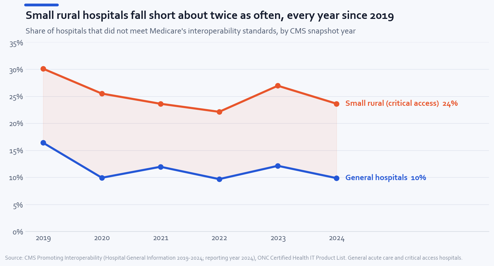 | 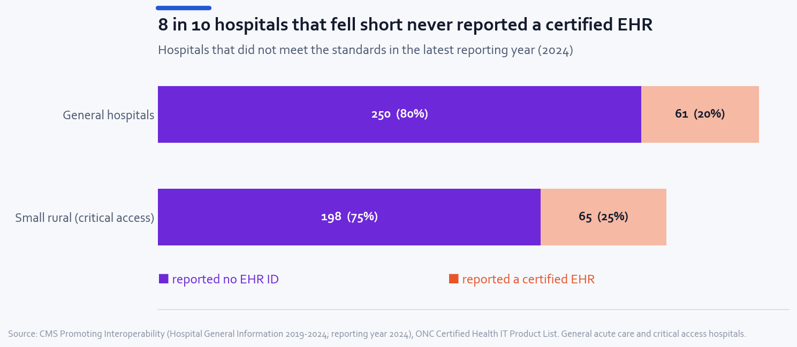 |
| 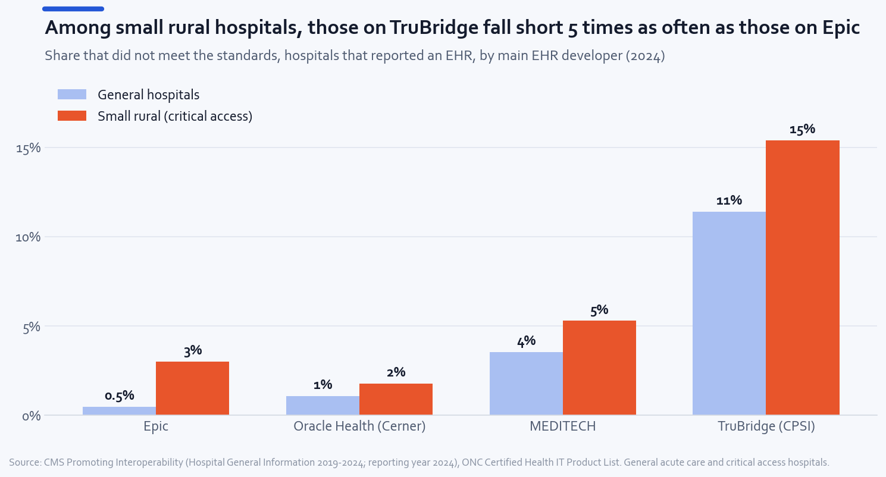 | 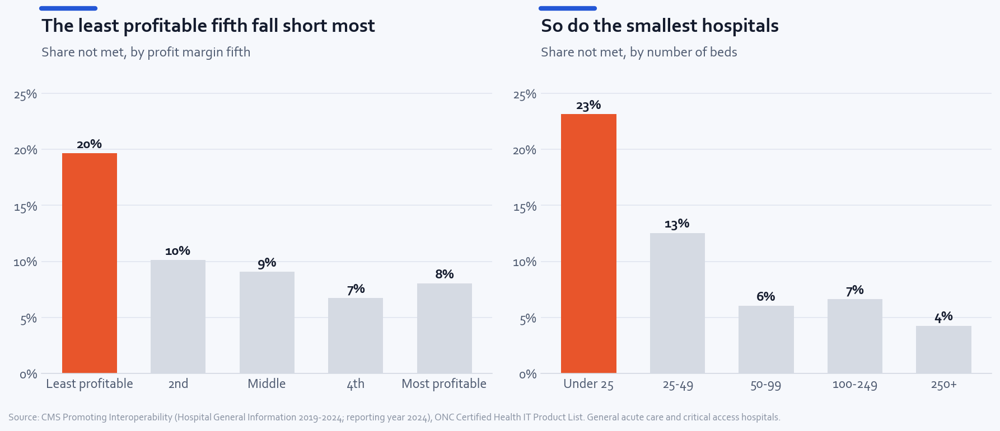 |
| 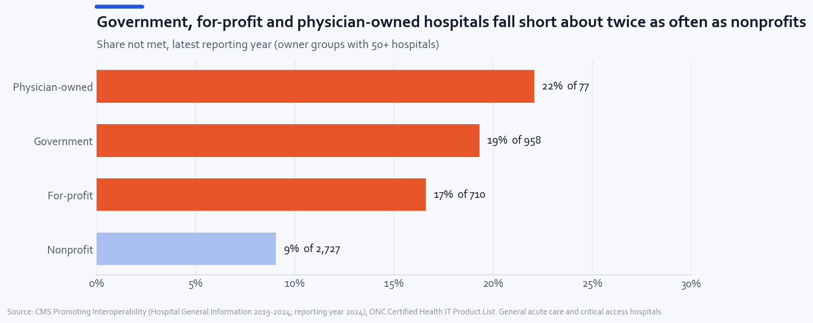 | 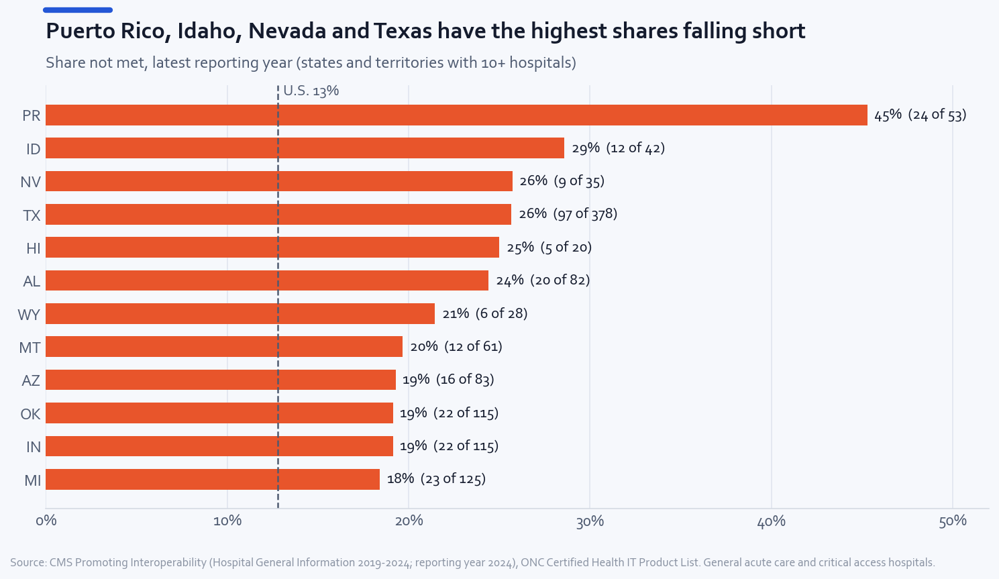 |
| 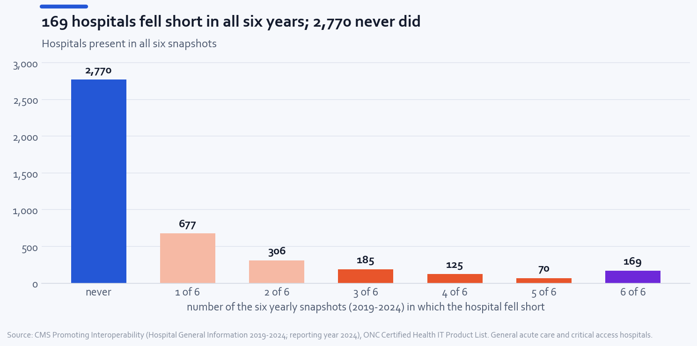 | 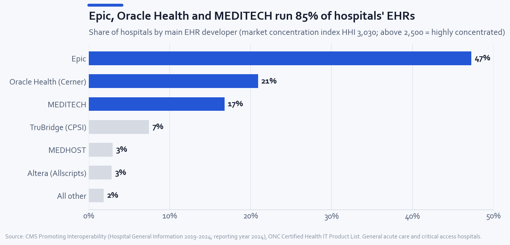 |

## Dashboard

Seven pages: **Overview**, **EHR Companies**, **Money and History**, **States**, **Find a Hospital**, **Data Quality**
and **Data Notes**. The filters on the right (hospital type, owner, rural or urban, state, EHR company) apply to
every page.

| | |
|---|---|
| 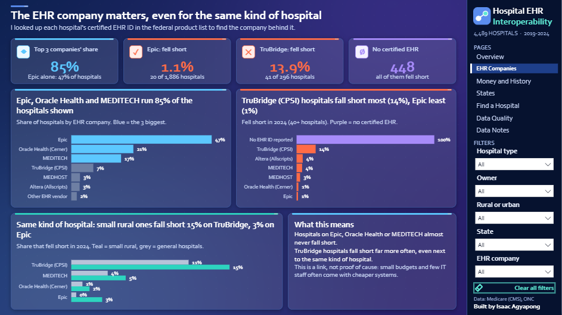 | 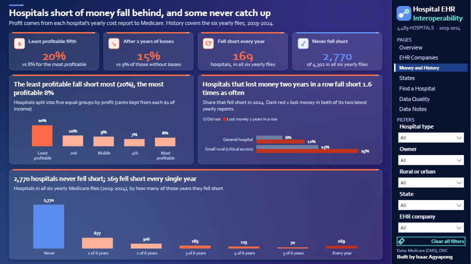 |
| 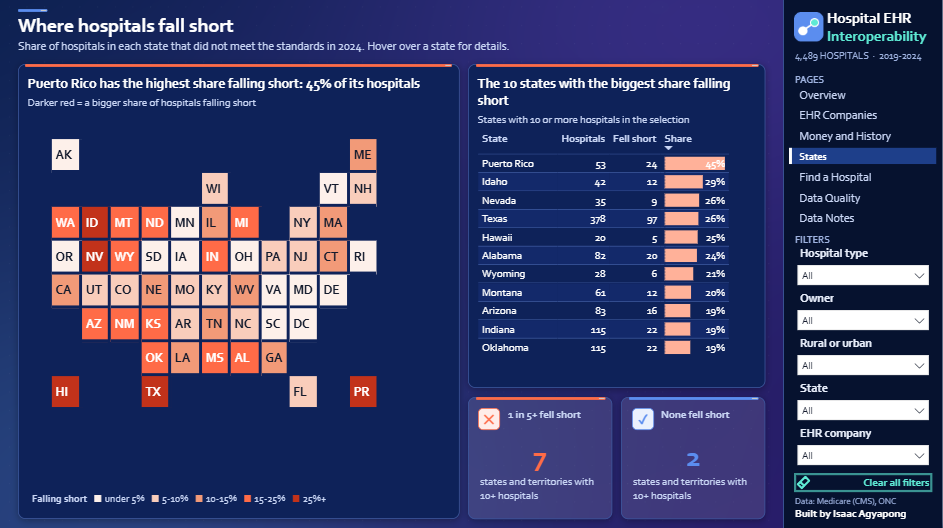 | 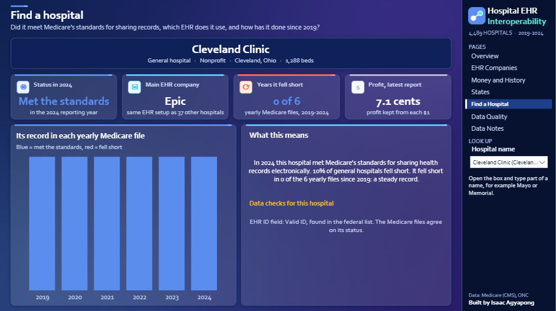 |
| 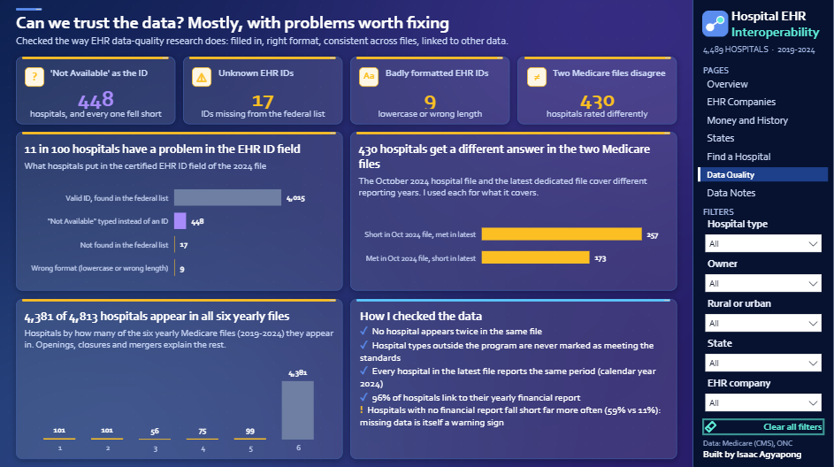 | 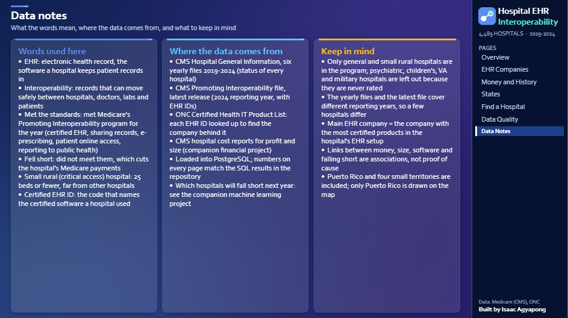 |

## Project structure

```
Data/raw/            manifest.json (source URLs, sizes, checksums); downloads and the CHPL cache are not in Git
Python/              01 download + CHPL look-ups, 02 load PostgreSQL, 03 run SQL, 04 notebook, 05 Power BI extracts,
                     06 Power BI project, make_background.py (dashboard artwork), viz_style.py (chart style)
SQL/                 00 database, 01 schemas, 02 transform, 03 data quality, 04 analytics views,
                     05 business questions, query_results.md (every query with its output)
dashboard/           EHR_Interoperability.pbip (open in Power BI Desktop), data/ (CSV extracts), assets/
Image/               charts and dashboard screenshots
run_all.py           rebuilds everything in order
```

## How to reproduce

1. Install Python 3.13, PostgreSQL 18 and Power BI Desktop.
2. `pip install -r requirements.txt`
3. Set the PostgreSQL login in `%APPDATA%\postgresql\pgpass.conf` (or `PG*` environment variables).
4. Build the companion [financial project](https://github.com/Isaac-Agyapong/US_Hospital_Financial_Performance_Analysis)
   first (this project reads its database).
5. Get a free API key from the [CHPL website](https://chpl.healthit.gov/) and put `CHPL_API_KEY=...` in a `.env`
   file in the project folder.
6. `python run_all.py` downloads the data (about 100 MB), looks up the EHR IDs, builds the database, runs every
   query, runs the notebook and generates the dashboard.

To only look at the dashboard: open `dashboard/EHR_Interoperability.pbip` in Power BI Desktop. It reads the CSV
files in `dashboard/data/`, so no database is needed. If you cloned the repository to a different folder, go to
Transform data > Edit parameters and set `DataFolder` to your `dashboard\data\` folder, then Refresh.

## Limitations

- The data says whether a hospital met the standards, not how well records actually move between providers.
- The yearly files and the latest dedicated file cover different reporting periods, so a hospital's status can
  differ between them (430 hospitals).
- The link between EHR company, money, size and falling short is an association, not proof of cause: small, poorer
  hospitals tend to buy smaller systems and have fewer IT staff.
- "Main EHR company" is my rule for EHR bundles that mix products from several companies.
- Puerto Rico and four small territories are included; only Puerto Rico is drawn on the dashboard map.

---

Built by **Isaac Agyapong** · M.S. Data Science, Florida Polytechnic University ·
[GitHub](https://github.com/Isaac-Agyapong)
